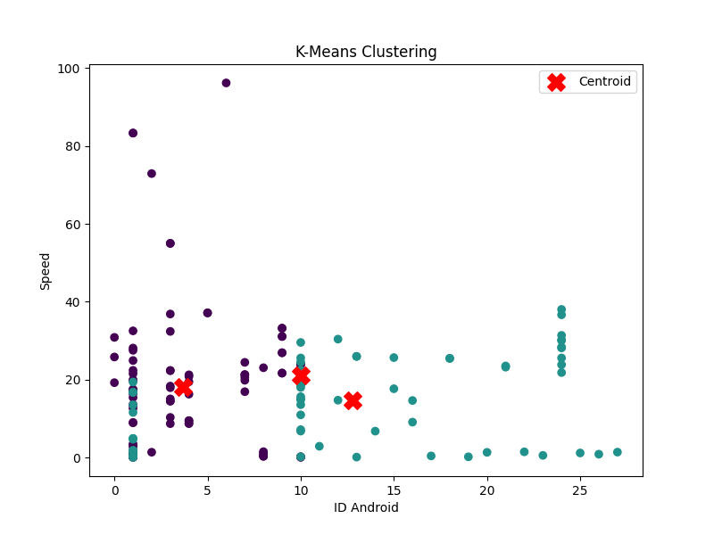
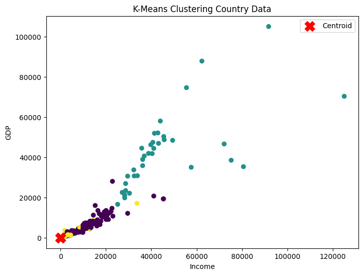

# Tugas K-Means Clustering

Nama            : Sarah Nurul Yakin 
Mata Kuliah     : Machine Learning  
Topik           : K-Means Clustering

Repository ini dibuat untuk memenuhi tugas mata kuliah Machine Learning pada materi K-Means Clustering.

Project ini terdiri dari dua tugas utama, yaitu implementasi K-Means menggunakan dataset GPS Trajectories dan implementasi clustering menggunakan dataset Country Data.

---

# Daftar Tugas

| No | Tugas | Dataset |
|---|---|---|
| 1 | Implementasi K-Means Clustering GPS Trajectories | GPS Trajectories |
| 2 | Implementasi K-Means Clustering Country Data | Country Data |

---

# Konsep Singkat K-Means Clustering

K-Means Clustering merupakan salah satu algoritma unsupervised learning yang digunakan untuk mengelompokkan data ke dalam beberapa cluster berdasarkan kemiripan karakteristik data.

Algoritma ini bekerja dengan menentukan titik pusat cluster atau centroid, kemudian menghitung jarak setiap data terhadap centroid tersebut. Data akan dimasukkan ke cluster dengan jarak terdekat. Proses ini dilakukan secara berulang hingga posisi centroid stabil.

Tahapan umum K-Means Clustering:

1. Menentukan jumlah cluster (K)
2. Menentukan centroid awal
3. Menghitung jarak data ke centroid
4. Mengelompokkan data ke cluster terdekat
5. Menghitung ulang centroid
6. Mengulangi proses sampai cluster stabil

Pada project ini digunakan:

```python
K = 3
```

---

# Struktur Folder Project

```bash
kmeans-clustering/
│
├── dataset/
│   ├── go_track_tracks.csv
│   └── Country-data.csv
│
├── notebook/
│   ├── tugas1_gps.ipynb
│   └── tugas2_country.ipynb
│
├── src/
│   ├── tugas1_kmeans_gps.py
│   └── tugas2_kmeans_country.py
│
├── hasil/
│   ├── hasil_cluster_gps.csv
│   ├── hasil_cluster_country.csv
│   ├── ringkasan_cluster_gps.csv
│   ├── ringkasan_cluster_country.csv
│   ├── visualisasi_cluster_gps.png
│   └── visualisasi_cluster_country.png
│
├── README.md
└── requirements.txt
```

---

# Penjelasan Folder

| Folder/File | Keterangan |
|---|---|
| dataset/ | Berisi dataset yang digunakan |
| notebook/ | Berisi file Jupyter Notebook |
| src/ | Berisi source code Python |
| hasil/ | Berisi hasil clustering dan visualisasi |
| README.md | Dokumentasi project |
| requirements.txt | Daftar library yang digunakan |

---

# Tugas 1 - GPS Trajectories

## Deskripsi

Tugas 1 merupakan implementasi algoritma K-Means Clustering menggunakan dataset GPS Trajectories dari UCI Machine Learning Repository.

Dataset ini berisi data perjalanan (trajectory) yang dikumpulkan dari aplikasi Android Go!Track.

Pada percobaan ini, clustering dilakukan berdasarkan:

- id_android
- speed

Tujuan clustering adalah untuk melihat pola perjalanan berdasarkan pengguna Android dan kecepatan perjalanan.

---

## Dataset

Dataset yang digunakan:

```bash
dataset/go_track_tracks.csv
```

Sumber dataset:

- https://archive.ics.uci.edu/dataset/354/gps+trajectories

---

## Tahapan Pengerjaan

Tahapan yang dilakukan pada Tugas 1:

1. Import library
2. Membaca dataset
3. Menampilkan informasi dataset
4. Menghapus kolom yang tidak digunakan
5. Memilih variabel clustering
6. Visualisasi persebaran data
7. Mengubah dataframe menjadi array
8. Normalisasi data menggunakan MinMaxScaler
9. Membuat model K-Means
10. Menambahkan hasil cluster ke dataframe
11. Membuat visualisasi cluster
12. Menyimpan hasil clustering
13. Menyimpan ringkasan cluster

---

## Visualisasi Hasil Clustering
<p align="center">
  
</p>

## Hasil Visualisasi Tugas 1

Visualisasi dilakukan menggunakan scatter plot untuk memperlihatkan persebaran cluster berdasarkan fitur distance dan speed.

Keterangan visualisasi:

- Setiap titik menunjukkan data perjalanan
- Warna berbeda menunjukkan cluster berbeda
- Titik merah menunjukkan centroid cluster

---

## Output Tugas 1

| File | Keterangan |
|---|---|
| hasil/hasil_cluster_gps.csv | Dataset hasil clustering |
| hasil/ringkasan_cluster_gps.csv | Ringkasan rata-rata cluster |
| hasil/visualisasi_cluster_gps.png | Visualisasi clustering |
| notebook/tugas1_gps.ipynb | Notebook pengerjaan tugas |
| src/tugas1_kmeans_gps.py | Source code Python |

---

# Tugas 2 - Country Data

## Deskripsi

Tugas 2 merupakan implementasi K-Means Clustering menggunakan dataset Country Data dari Kaggle.

Dataset ini berisi data sosial dan ekonomi beberapa negara seperti:

- income
- gdpp
- inflation
- health
- life expectancy
- child mortality

Clustering dilakukan untuk mengelompokkan negara berdasarkan karakteristik ekonomi dan sosial yang dimiliki.

---

## Dataset

Dataset yang digunakan:

```bash
dataset/Country-data.csv
```

Sumber dataset:

- https://www.kaggle.com/datasets/rohan0301/unsupervised-learning-on-country-data

---

## Alasan Memilih Dataset

Dataset Country Data dipilih karena:

- Memiliki banyak fitur numerik
- Cocok digunakan untuk K-Means Clustering
- Data mudah divisualisasikan
- Dapat digunakan untuk analisis ekonomi negara

---

## Tahapan Pengerjaan

Tahapan yang dilakukan pada Tugas 2:

1. Import library
2. Membaca dataset
3. Menampilkan informasi dataset
4. Memilih kolom numerik
5. Visualisasi persebaran data
6. Mengubah dataframe menjadi array
7. Normalisasi data
8. Membuat model K-Means
9. Menambahkan hasil cluster ke dataframe
10. Membuat visualisasi cluster
11. Menyimpan hasil clustering
12. Menyimpan ringkasan cluster

---

## Visualisasi Hasil Clustering
<p align="center">
  
</p>

## Hasil Visualisasi Tugas 2

Visualisasi dilakukan menggunakan scatter plot berdasarkan:

- income
- gdpp

Keterangan visualisasi:

- Setiap titik menunjukkan data negara
- Warna berbeda menunjukkan cluster berbeda
- Titik merah menunjukkan centroid cluster

---

## Output Tugas 2

| File | Keterangan |
|---|---|
| hasil/hasil_cluster_country.csv | Dataset hasil clustering |
| hasil/ringkasan_cluster_country.csv | Ringkasan rata-rata cluster |
| hasil/visualisasi_cluster_country.png | Visualisasi clustering |
| notebook/tugas2_country.ipynb | Notebook pengerjaan tugas |
| src/tugas2_kmeans_country.py | Source code Python |

---

# Cara Menjalankan Project

## Clone Repository

```bash
git clone https://github.com/Sarahnurulyakin/K-Means-Clustering-
```

## Masuk ke Folder Project

```bash
cd kmeans-clustering
```

## Install Library

```bash
pip install -r requirements.txt
```

## Menjalankan Jupyter Notebook

```bash
jupyter notebook
```

---

# Library yang Digunakan

| Library | Fungsi |
|---|---|
| pandas | Membaca dan mengolah dataset |
| numpy | Mengolah array dan data numerik |
| matplotlib | Membuat visualisasi |
| scikit-learn | K-Means dan preprocessing |
| jupyter | Menjalankan notebook |

---

# Kesimpulan

Berdasarkan percobaan yang telah dilakukan, algoritma K-Means Clustering berhasil diterapkan pada dua dataset yang berbeda, yaitu GPS Trajectories dan Country Data.

Pada Tugas 1, proses clustering dilakukan menggunakan dataset GPS Trajectories dengan fitur distance dan speed. Hasil clustering menunjukkan bahwa data perjalanan dapat dikelompokkan berdasarkan pola jarak dan kecepatan perjalanan. Visualisasi cluster memperlihatkan bahwa setiap kelompok data memiliki pola yang berbeda, sedangkan titik centroid menunjukkan pusat dari masing-masing cluster.

Pada Tugas 2, algoritma K-Means diterapkan pada dataset Country Data untuk mengelompokkan negara berdasarkan kondisi ekonomi dan sosial seperti income dan GDP per kapita. Hasil clustering menunjukkan bahwa negara-negara dengan kondisi yang serupa dapat dikelompokkan ke dalam cluster yang sama sehingga mempermudah proses analisis data.

Sebelum proses clustering dilakukan, data terlebih dahulu dinormalisasi menggunakan metode Min-Max Scaling agar setiap fitur memiliki rentang nilai yang seimbang. Tahap normalisasi penting dilakukan karena algoritma K-Means menggunakan perhitungan jarak antar data.

Visualisasi hasil clustering membantu memperlihatkan persebaran data serta posisi centroid pada setiap cluster. Selain itu, hasil clustering juga disimpan ke dalam file CSV sehingga dapat digunakan kembali untuk analisis lebih lanjut.

Secara keseluruhan, algoritma K-Means Clustering dapat digunakan untuk menemukan pola atau kelompok data tanpa memerlukan label kelas. Metode ini cukup efektif digunakan pada data numerik dan dapat membantu proses analisis data di berbagai bidang seperti transportasi, ekonomi, dan pengelompokan data.